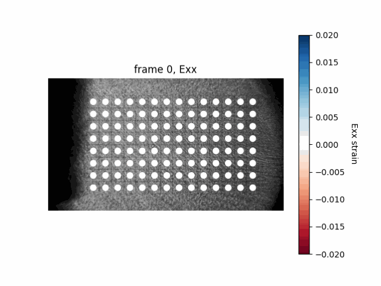
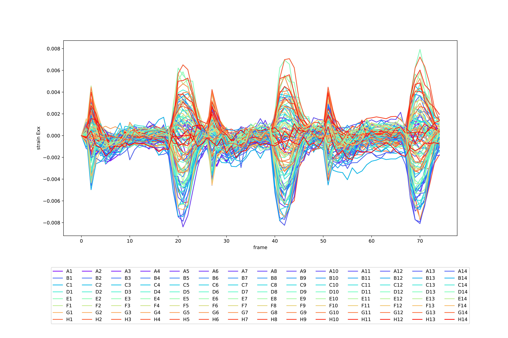
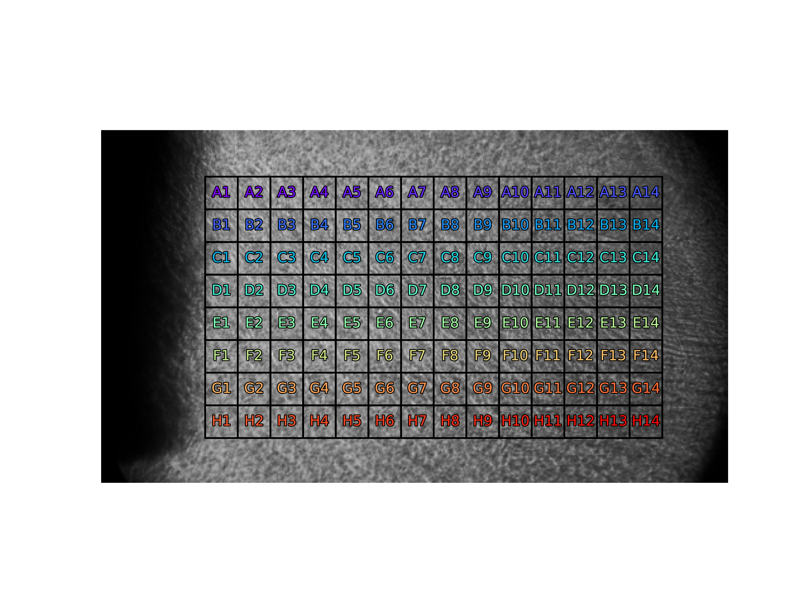

# Raman_Manuscript_2023

## Introduction 
This repository contains the code used to quantify the mechanical behavior of optically stimulated muscle sheets as described in the manuscript "Magnetic Hydrogel Actuators as Mechanically Active Cell Culture Substrates" by Brandon Rios, Angel Bu, Tara Sheehan, Hiba Kobeissi, 
Emma Lejeune, and Ritu Raman (link forthcoming). 

<p align = "center">

</p>

## Code description
The ``code`` folder in this repository contains $4$ python files: ``prepare_files.py``, ``run_code.py``, ``image_analysis.py``, and ``strain_analysis.py``. 

* ``prepare_files.py`` file contains the script required to perform the necessary video pre-processing steps and skip the frames where light stimulation takes place.  
* ``run_code.py`` file runs the tracking pipeline to output and visualize the results that mainly include full-field displacements and sub-domain averaged strains. 
* ``image_analysis.py`` script contains the functions to identify fiducial markers, track them across consecutive frames, and compute full-field displacement results. 
* ``strain_analysis.py`` script contains the functions to divide the muscle sheet into a grid box and compute the average Green-Lagrange strain in each of these subdomains.  

For detailed information on the main functionalities contained in ``image_analysis.py`` and ``strain_analysis.py``, we refer the interested user to the main GitHub repository from which this current one is adapted: [MicroBundleCompute](https://github.com/HibaKob/MicroBundleCompute) and the accompanying manuscript (link forthcoming). 

## Running the code
In the ``tutorial`` folder, we include a single experimental example, "control1.tif", to demonstrate the required initial folder structure as well as the steps to successfully run the provided scripts in the ``code`` folder. Specifically, the original files to be processed should be included in a folder named ``original_files``.

The ``tutorial`` folder should, before running any code, contain the following:

```bash
|___ tutorial
|        |___ original_files
|                |___ "control1.tif"  (download the file using the provided link)
```

The first step is to run the ``prepare_files.py`` script. In a Terminal running python3 (for example a conda virtual environment where all the needed libraries are installed, check [MicroBundleCompute](https://github.com/HibaKob/MicroBundleCompute) for more information on setting up a virtual environment), navigate to the folder where ``prepare_files.py’’ is saved (for example cd /Users/Desktop/code).
Then simply run the command ``python3 prepare_files.py`` followed by the path of the main folder containing ``original_files``. For example:

```bash
python3 prepare_files.py /Users/Desktop/tutorial
```

Running the ``prepare_files.py`` script creates new folders and files as follows:
```bash
|___ tutorial
|        |___ original_files
|                |___ "control1.tif"
|        |___ prepared_files
|                |___ "control1.npy"
|        |___ visualize_files
|                |___ "threshold.pdf"
|        |___ control
|                |___ movie
|                       |___"*.TIF"
```

The processed movies are outputted as 1) ``.npy`` files saved in ``prepared_files`` folder and 2) individual ``.TIF`` frames saved in ``movie`` folder contained in an automatically created folder having the same name as the input sample as specified inside the ``prepare_files.py`` file.
The purpose of this step is to exclude frames with much higher intensities than the median intensity of the entire movie. The "threshold.pdf" file within the "visualize_files" folder visualizes the frames to be excluded by marking them with red dots. 
 
The second step is to manually create a binary mask of the muscle region and save it as a binary text file where the background is ``0`` and the muscle sheet is ``1``. The mask should be saved as ``tissue_mask.txt`` in a folder named ``masks`` or otherwise, the code pipeline would fail. We provide ``tissue_mask.png`` as a mere visualization. 

The ``tutorial`` folder should now contain the following:
 
 ```bash
|___ tutorial
|        |___ original_files
|                |___ "control1.tif"
|        |___ prepared_files
|                |___ "control1.npy"
|        |___ visualize_files
|                |___ "threshold.pdf"
|        |___ control1
|                |___ movie
|                       |___"*.TIF"
|                |___ masks
|                       |___"tissue_mask.txt"
|                       |___"tissue_mask.png" (optional)
```

The next step is to run the tracking algorithm and visualize the output. To do so, simply run the command ``python3 run_code.py`` in the same Terminal running python as above, with the parent directory specified as the one containing the files ``run_code.py``, ``image_analysis.py``, and ``strain_analysis.py`` (in case it is different than the one containing ``prepared_files.py``), followed by the path of the example to be tracked. For example, to run "control1" tutorial:

```bash 
python3 run_code.py /Users/Desktop/tutorial/control1
```

Running the code generates the following outputs:
```bash
|___ tutorial
|        |___ original_files
|                |___ "control1.tif"
|        |___ prepared_files
|                |___ "control1.npy"
|        |___ visualize_files
|                |___ "threshold.pdf"
|        |___ control1
|                |___ movie
|                       |___"*.TIF"
|                |___ masks
|                       |___"tissue_mask.txt"
|                       |___"tissue_mask.png" (optional)
|                |___ results
|                       |___"pos_x.txt"
|                       |___"pos_y.txt"
|                       |___"strain__Fxx.txt"
|                       |___"strain__Fxy.txt"
|                       |___"strain__Fyx.txt"
|                       |___"strain__Fyy.txt"
|                       |___"strain__sub_domain_info.txt"
|                       |___"strain__x.txt"
|                       |___"strain__y.txt"
|                |___ visualizations
|                       |___pngs
|                           |___pngs_abs
|                               |___"%04d_disp.png"
|                           |___pngs_x
|                               |___"%04d_disp.png"
|                           |___pngs_y
|                               |___"%04d_disp.png"
|                       |___"abs_disp.gif"
|                       |___"x_disp.gif"
|                       |___"y_disp.gif"
|                       |___strain_pngs
|                           |___Exx
|                               |___"%04d_strain.png"
|                           |___Exy
|                               |___"%04d_strain.png"
|                           |___Eyy
|                               |___"%04d_strain.png"
|                           |___"strain_sub_domain_key.pdf"
|                       |___"sub_domain_strain_Exx.gif"
|                       |___"sub_domain_strain_Exy.gif"
|                       |___"sub_domain_strain_Eyy.gif"


```
As a general note, it is crucial to have the files ``run_code.py``, ``image_analysis.py``, and ``strain_analysis.py`` saved in the same directory. It is also recommended to have ``prepared_files.py`` file in the same one as well. 

### Understanding the output files
The outputs of running this code will be stored in the ``results`` folder as text files. 
* ``"pos_x.txt"`` and ``"pos_y.txt"`` files contain information regarding the x (horizontal) and y (vertical) positions of the tracked marker (fiducial) points. In these text files, the rows correspond to individual markers, while the columns correspond to the frames.
* ``"strain__Fxx.txt"``, ``"strain__Fxy.txt"``, ``"strain__Fyx.txt"``, and ``"strain__Fyy.txt"`` files store the corresponding component of the deformation gradient for each subdomain per frame.
* ``"strain__sub_domain_info.txt"`` file contains information about the strain subdomains. The first row contains the number of row sub divisions and the number of column sub divisions. The second row contains the number of pixels in the subdomain sides. 
* ``"strain__x.txt"`` and ``"strain__y.txt"`` contain the x and y positions of the center of each subdomain per frame.

The visualizations of these outputs will be stored in the ``visualizations`` folder as ``.png`` and ``.gif`` files. Plots, however, are stored as ``.pdf`` files for higher resolution.

For the displacement tracking results, we plot absolute displacement of the identified markers as well as the displacements in the x and y directions.

<p align = "center">


</p>

For the strain tracking results, we plot $E_{xx}$, $E_{xy}$, and $E_{yy}$ for each subdomain. Specifically, we visualize these strains organized in space in ``sub_domain_strain_E**.gif`` and ``%04d_strain.png``, and organized in time (i.e. as a timeseries vs. frame number) in ``strain_timeseries_E**.pdf``. The legend in the timeseries plots corresponds to the subdomain labels in ``strain_sub_domain_key.pdf``.

<p align = "center">


 
</p>


## References to related work 
Related work can be found here:
* Das, S. L., Sutherland, B. P., Lejeune, E., Eyckmans, J., & Chen, C. S. (2022). Mechanical response of cardiac microtissues to acute localized injury. American Journal of Physiology-Heart and Circulatory Physiology, 323(4), H738-H748.

Related repositories include:
* https://github.com/elejeune11/Das-manuscript-2022
* https://github.com/HibaKob/MicroBundleCompute
* https://github.com/HibaKob/SyntheticMicroBundle (synthetic dataset)

## Contact information
For additional information, please contact Emma Lejeune `elejeune@bu.edu` or Hiba Kobeissi `hibakob@bu.edu`.
